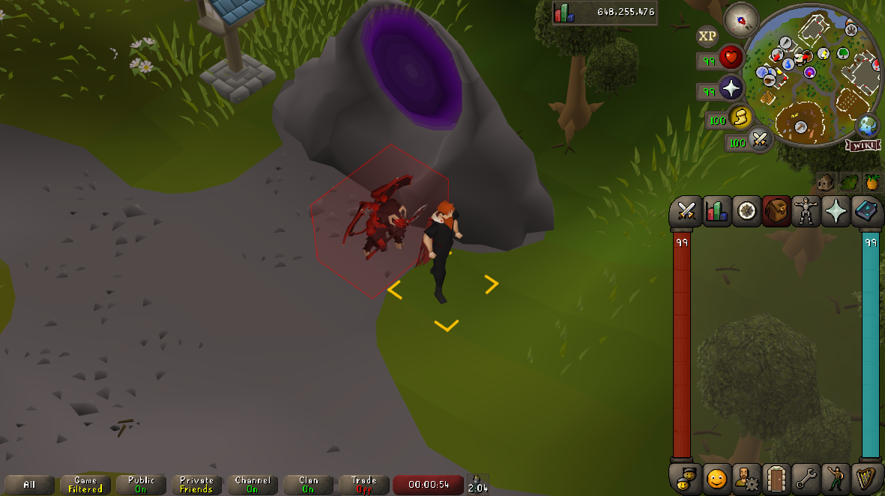
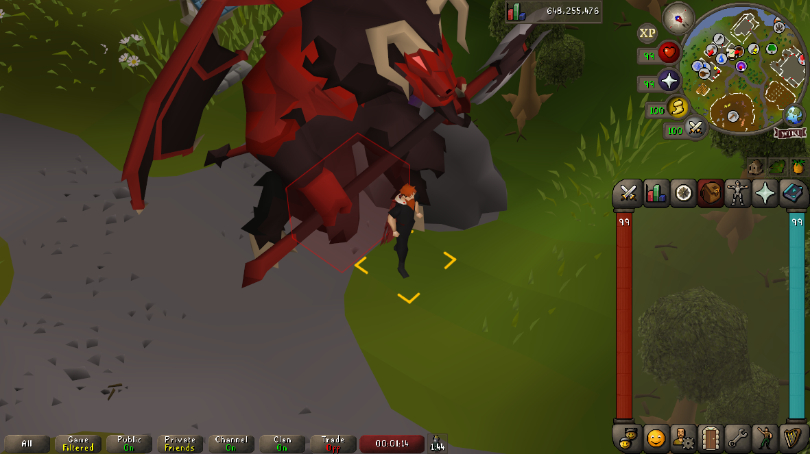
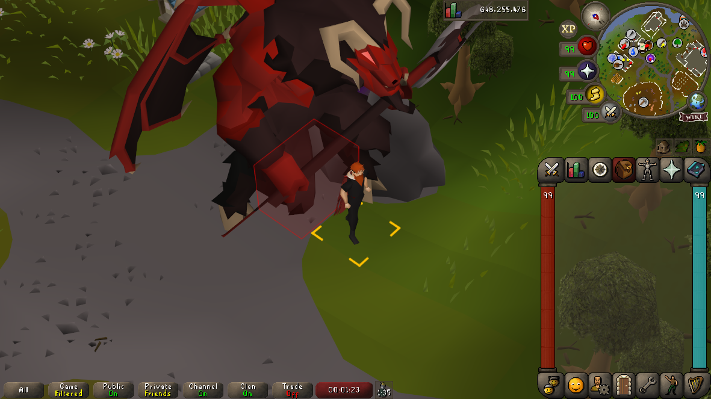
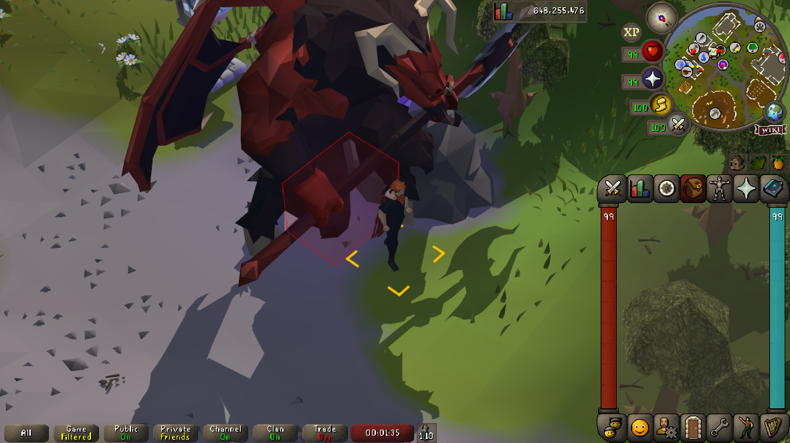
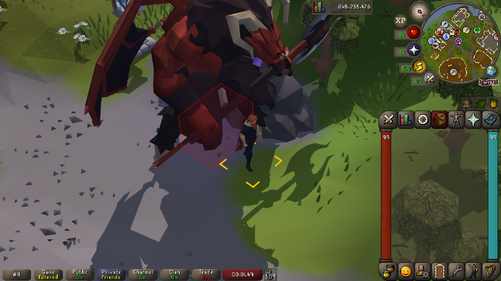

# Big Pets
Requires a GPU renderer: built-in
**GPU**, **GPU Experiment
al**, **GPU Legacy**, or **117 HD**.
Change the visual size of your currently following pet from **0% to 500%**.
Normal size is **100%**, **0%** hides the pet's model.

**Options:**
- **Resize all pets** to apply the same size to other players' followers and POH menagerie pets.
- **Filter cats and dogs**: all twelve pet dog breeds and their puppies, all cat colours and ages, all hellcats, and Clockwork cat.
- **Filter quest and Event pets**: Spooky chair, Pet rock, Egg (Humphrey Dumphrey), all three fishbowl fish colours, Mayor of Catherby, and every Archibald variant. **(Except the Broav because he is cool)**

## Rendering
Big Pets draws a resized copy of the pet while retaining the original NPC for its clickbox and right-click menu.
Requires a renderer plugin, either:
- Built-in GPU
- GPU (Experimental)
- 117 HD
For these three zone renderer use RuneLite's object rendering callback to hide the original visual.
- GPU (Legacy)
- 117 HD's legacy
These use a forwarding adapter that skips the original visual but performs click detection with the model.

## Clickboxes

Clickbox size is kept intact
### Original size

### With GPU

### With GPU (Experimental)

### With GPU (Legacy)

### With 177 HD

### With 117 HD legacy renderer

